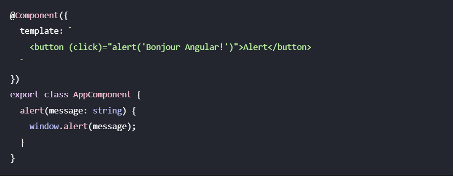

# Basicx

* Le data binding permet de lire et/ou synchroniser les propriétés et méthodes de vos composants directement dans leurs templates.

Il existe 4 types de data binding dans Angular.
- Interpolation
L’interpolation permet d’afficher une valeur dans le template. Pour cela, on utilise la syntaxe `{{ }}`.

- Property binding
Le property binding permet de lier une propriété d’un élément HTML à une valeur dans le composant. Pour cela, on utilise la syntaxe `[ ]`.

- Event binding
L’event binding permet de lier un événement d’un élément HTML à une méthode dans le composant. Pour cela, on utilise la syntaxe ( ). Il existe beaucoup d’événements comme `click`, `change`, `input`, `keyup`, `keydown`, `mouseover`, `mouseout`, `focus`, `blur`, etc.

- Two-way binding
Le two-way binding est une fonctionnalité qui crée une connexion bidirectionnelle entre un élément HTML et un composant. Cela signifie que toute modification apportée à l’élément est reflétée dans le composant, et vice-versa. Pour réaliser cette liaison, on utilise la syntaxe `[( )]`.

